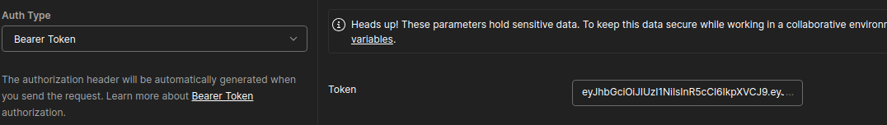

# CurrencyTask
This repository was created for the Interview task

# How to run the app ?

1. First thing you need to do is run the following command anywhere you want on your computer

git clone https://github.com/olezaErshov/CurrencyTask.git

2. After it, you need to verify are the docker and docker-compose exist on your device. You can do that by running command docker and docker compose.

If everything is fine  you can go ahead and ran the app. If don't you need to install all this stuff. You can do that according to that guide https://docs.docker.com/engine/install/  and this one https://docs.docker.com/compose/install/

3. Now we're  sure that everything is ready to run application. You need to go to the app's home directory. it will be something like that you_device_dir/CurrencyTask/ . After it you need to run the following command -- docker compose up.

# How to use this app ?

1. This app has only server part without any user-friendly interface. To interact with it you need use postman or any other api interaction tool. Next  I'll talk about postman. It's important to mention that worker is configured on UTC 0 time zone.

## Endpoints:

1. http://0.0.0.0:8000/api/v1/auth/sign-in -- You need to use this endpoint firstly to get access for other endpoints. In body you need to write user login and password like that:
   {
   "login": "oleg",
   "password": "pass1"
   }
There are  only 2 available users: 

{Login: "oleg", Password: "pass1"},
{Login: "egor", Password: "pass2"}.

Responses:
1. status code -- 200, response body -- access token
2. status code -- 404, response body -- error (you'll get it if you use unavailable user)
3. status code -- 500, response body -- error (some internal issue)

2. http://localhost:8000/api/v1/currency/rate?date=2024-10-15 -- This endpoint you can use to get usd-rub rate in specific day. This day you have to specify in query parameter after date= in format yyyy-mm-dd.

Responses:
1. status code -- 200, response body -- exchange usd rate to rub.
2. status code -- 401, reponse body -- error (you'll get it if you don't use auth token properly) Use him like that

3. status code -- 400, response body -- error (you'll get it if you put a wrong data format)
4. status code -- 404, response body -- error (you'll get it if you there are no currency rate in the day you want)
5. status code -- 500, response body -- error (some internal issue)

3. http://localhost:8000/api/v1/currency/history?first_date=2024-10-15&last_date=2024-10-15 -- This endpoint you can use to get exchange rate history between to dates including those days. Like in example above you have to specify those day in query parameters.

Responses:
1. status code -- 200, response body -- exchange usd rate to rub changes history.
2. status code -- 401, reponse body -- error (you'll get it if you don't use auth token properly) Use him like in example above
3. status code -- 400, response body -- error (you'll get it if you put a wrong data format or first date is higher or equal then last one)
4. status code -- 404, response body -- error (you'll get it if you there are no currency rate changes history in the days range you use)
5. status code -- 500, response body -- error (some internal issue)

